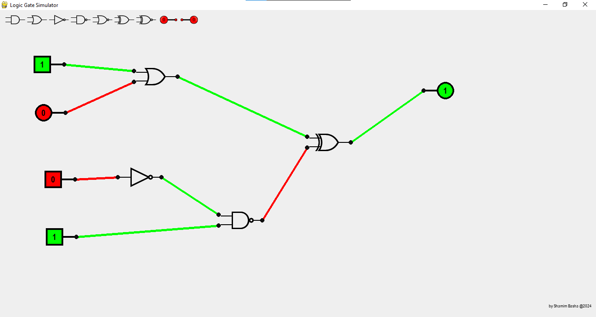
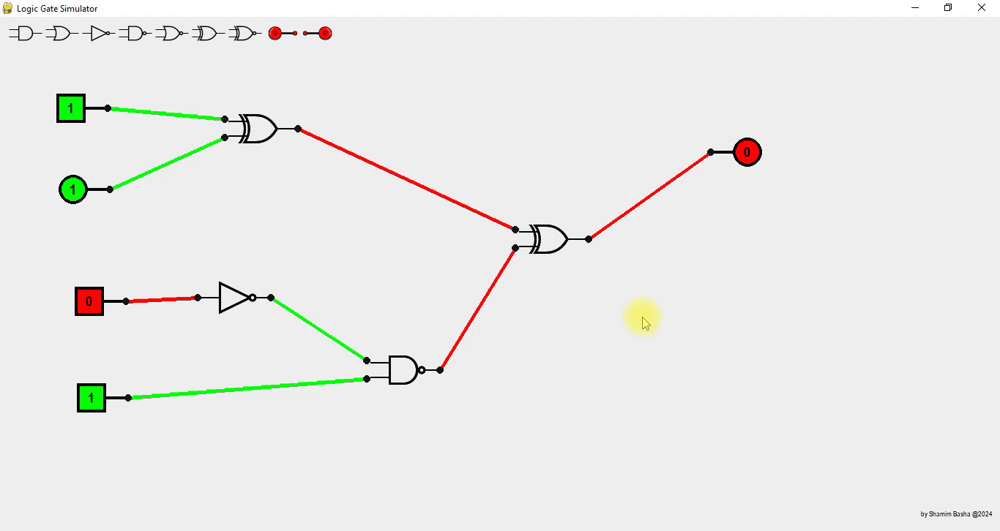
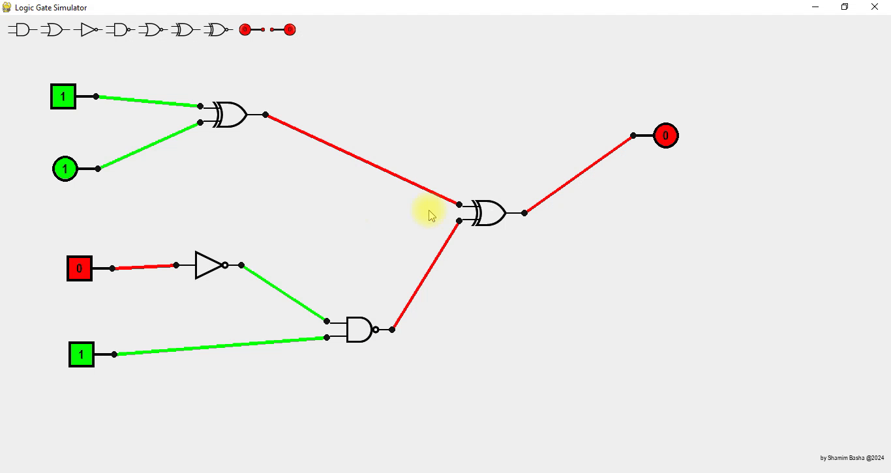
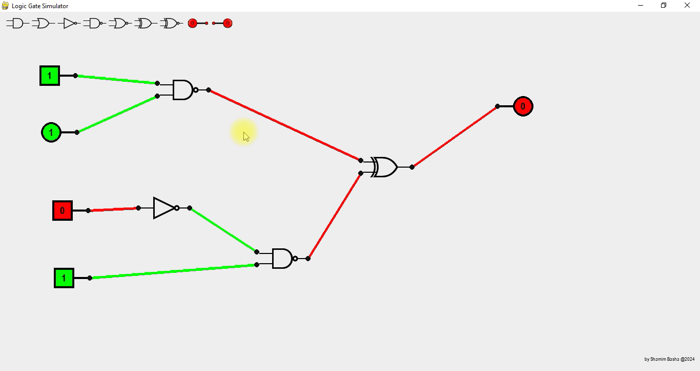
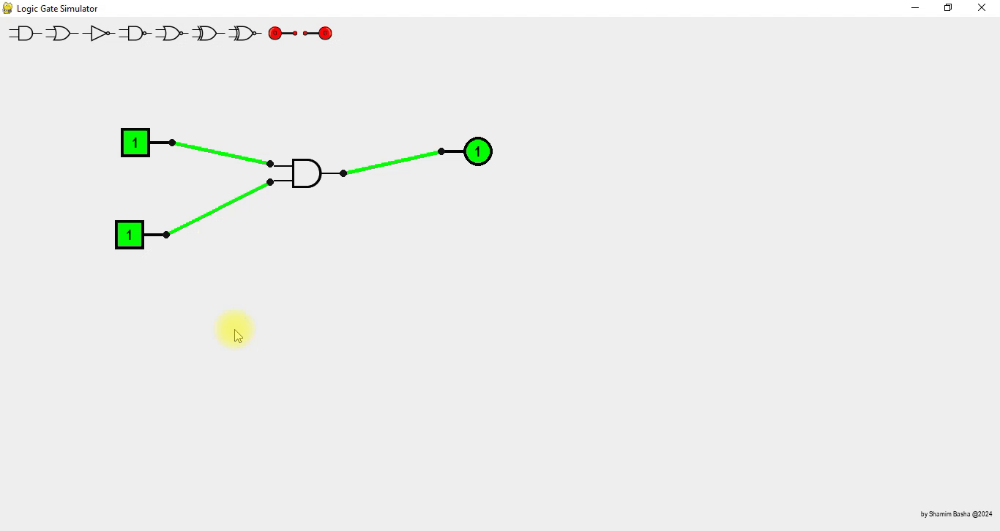
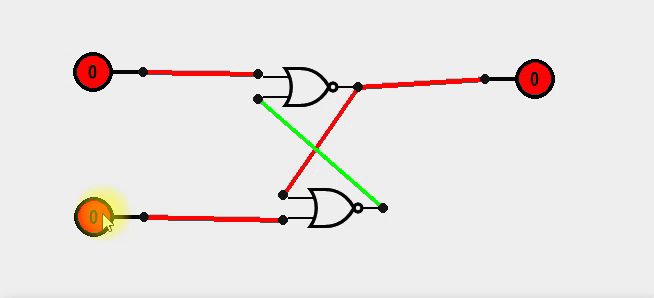

# Logic Gate Simulator

## Overview

The Logic Gate Simulator is a Python-based project utilizing the Pygame module to create a graphical interface for simulating logic gates. This simulator allows users to design and simulate digital circuits by combining various logic gates in a user-friendly environment.



## Features

- **Interactive Interface:** The simulator provides an intuitive and easy-to-use graphical interface for designing digital circuits.<br/>


- **Real-time Simulation:** The simulator provides real-time simulation of the circuit, allowing users to observe the output dynamically as inputs change.

- **Multiple Logic Gates:** Supports a variety of logic gates, including AND, OR, NOT, NAND, NOR, XOR, and more.

- **Deleting Gates:** Users can delete the specific gates using right-click menu.<br/>


- **Remove all Connection:** Users can remove all the connections froom and to the gate in single-click.<br/>


- **Customizable Gates:** Users can change the type of the gate in single-click.<br/>


- **Customizable Inputs:** Users can customize input values to simulate different scenarios and test the behavior of their circuits and also can change the type of buttons to push or switch.

- **Customizable Inout button type:** Users can change the input button type in single-click.<br/>



## Installation

1. **Clone the Repository:**
   ```bash
   git clone https://github.com/your-username/logic-gate-simulator.git
   ```

2. **Install Dependencies:**
   ```bash
   pip install -r requirements.txt
   ```

## Usage

1. **Run the Simulator:**
   ```bash
   python logic_gate_simulator.py
   ```

2. **Design Circuit:**
   - Drag and drop logic gates onto the stage.
   - Connect the gates by dragging wires between them.

3. **Set Inputs:**
   - In switch mode -> click on input nodes to toggle their values (0 or 1).
   - In push mode -> Hold the left-mouse-button on input nodes to turn on (1).

4. **Simulation:**
   - Observe the real-time simulation as the output changes based on input values.

5. **More to be added:**
   - Save your circuit design and load it for future use.
   - Derive the equation for your circuit.
   - Create the logic-gate combination from the equation provided.
   - Simplifying the equation using boolean-algebra.
   - Creation of custom gates(user-defined logic gates).

## Supported Logic Gates

- AND
- OR
- NOT
- NAND
- NOR
- XOR
- XNOR

## SR-Flip-Flop created using using this program
- What is SR flip-flop ? : [click here](https://en.wikipedia.org/wiki/Flip-flop_(electronics)) <br/>


## Acknowledgements

- This project is built using the Pygame library. (Link to Pygame: [https://www.pygame.org/](https://www.pygame.org/))

## Contributing

Contributions are welcome! Feel free to open issues or submit pull requests to enhance the simulator.

## License

This project is licensed under the MIT License - see the [LICENSE](LICENSE) file for details.